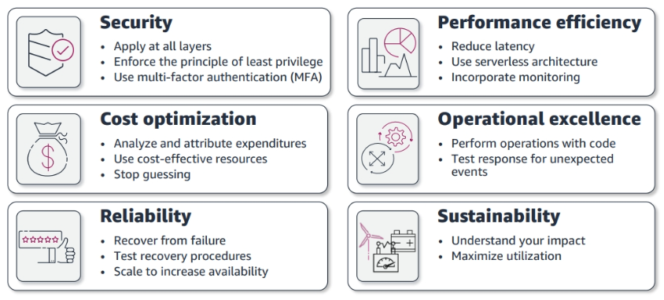

# Well Architectured Framework

## General Guiding Principles

- Stop guessing capacity needs
- Test systems at production scale
- Automate to make architectural experimentation easier
- Allow for evolutionary architectures, design based on changing requirements
- Drive architecture using data
- Improve through game days, simulate applications for flash sale days

## 6 pillars

1. **Security** – Use AWS security best practices to build policies and processes to protect data and assets. Allow auditing and traceability. Monitor, alert, and audit actions and changes to your environment in real time
2. **Cost Optimization** - Achieve cost efficiency while considering fluctuating resource needs.
3. **Reliability** - Meet well defined operational thresholds for applications. This includes support to recover from failures, handling increased demand, and mitigating disruption.
4. **Performance Efficiency** - Deliver efficient performance for a set of resources like instances, storage, databases, space, and time.
5. **Operational Excellence** - Deliver efficient performance for a set of resources like instances, storage, databases, space, and time.
6. **Sustainability** - Deliver efficient performance for a set of resources like instances, storage, databases, space, and time.

**They are not something to balance, or trade-offs, they are synergy!**

## 1ST pillar: Security

- Includes the ability to protect information, systems and assets while delivering business value through risk assessments and mitigation strategies
- Design principles:
    - Implement a string identity foundation
    - Enable traceability
    - Apply security at all layers
    - Automate security best practices
    - Protect data in transit and at rest
    - Keep people away from data
    - Prepare for security events
- In terms of AWS services:
    - Identity and access management:
        - IAM
        - AWS-STS
        - MFA token
        - AWS Organizations
    - Detective controls:
        - AWS Config
        - CloudTrail
        - CloudWatch
    - Infrastructure protection:
        - CloudFront
        - VPC
        - AWS Shield
        - AWS WAF
        - Amazon Inspector
    - Data protection:
        - KMS
    - Incident response:
        - IAM
        - AWS CloudFormation
        - CloudWatch Events
  

## 2nd pillar: Cost Optimization

- Includes the ability to run systems to deliver business value at the lowest price point
- Design principles:
    - Adopt a consumption mode, pay only for what you use
    - Measure overall efficiency
    - Stop spending money on data center operations
    - Analyze and attribute expenditure
    - Use managed and application level services to reduce cost of ownership
- In terms of AWS services:
    - Expenditure awareness:
        - AWS Budgets
        - AWS Cost and Usage Report
        - AWS Cost Explorer
        - Reserved Instance Reporting
    - Cost-effective resources:
        - Spot instances
        - Reserved Instances
        - S3 Glacier
    - Matching supply and demand:
        - Auto Scaling
        - AWS Lambda
    - Optimize over time:
        - AWS Trusted Advisor
        - AWS Cost and Usage Report
        - AWS News Blog
        - 
## 3rd pillar: Reliability

- Ability of a system to recover from infrastructure or service disruptions, dynamically acquire computing resources to meet demand and mitigate disruptions such as misconfigurations or transient network issues
- Design principles:
    - Test recovery procedures
    - Automate recover from failure
    - Scale horizontally to increase aggregate system availability
    - Stop guessing capacity, use auto-scaling
    - Manage change in automation
- In terms of AWS services:
    - Foundations:
        - IAM
        - VPC
        - Service Limits
        - AWS Trusted Advisor
    - Change management:
        - Auto Scaling
        - CloudWatch
        - CloudTrail
        - Config
    - Failure Management:
        - Backups
        - CloudFormation
        - S3, Glacier
        - Route53

## 4th pillar: Performance Efficiency

- Includes the ability to use computing resources efficiently to meet system requirements and to maintain that efficiency as demand changes and technologies evolve
- Design principles:
    - Democratize advanced technologies
    - Go global in minutes
    - Use serverless architectures
    - Experiment more often
    - Mechanical sympathy, be aware of all AWS services
- In terms of AWS services:
    - Selection:
        - AWS Auto Scaling
        - AWS Lambda
        - EBS
        - S3
        - RDS
    - Review:
        - CloudFormation
        - AWS News Blog
    - Monitoring:
        - CloudWatch
        - AWS Lambda
    - Tradeoffs:
        - ElastiCache
        - Snowball
        - CloudFront
    
## 5th pillar: Operational Excellence

- Includes the ability to run and monitor systems to deliver business value and to continually improve supporting processes and procedures
- Design principles:
    - Perform operations as code - infrastructure as code
    - Annotate documentation - automate creation of annotated documentation after every build
    - Make frequent, small, reversible changes
    - Refine operations procedure frequently and ensure team members are familiar with it
    - Anticipate failure and learn from operational failure
- In terms of AWS services:
    - Prepare:
        - CloudFormation
        - AWS Config
    - Operate:
        - CloudFormation
        - Config
        - CloudTrail
        - CloudWatch
        - XRay
    - Evolve:
        - CloudFormation
        - CodeBuild
        - CodeDeploy
        - CodePipeline

## 6th pillar: Sustainability
- The discipline of sustainability addresses the long-term environmental, economic, and societal impact of your business activities. 
- Your business or organization can have negative environmental impacts like direct or indirect carbon emissions, unrecyclable waste, and damage to shared resources like clean water.
-  The Greenhouse Gas Protocol organizes carbon emissions into the following scopes, along with relevant emission examples within each scope for a cloud provider such as AWS:

   - **Scope 1**: All direct emissions from the activities of an organization or under its control. For example, fuel combustion by data center backup generators.

   - **Scope 2**: Indirect emissions from electricity purchased and used to power data centers and other facilities. For example, emissions from commercial power generation.

   - **Scope 3**: All other indirect emissions from activities of an organization from sources it doesn’t control. AWS examples include emissions related to data center construction, and the manufacture and transportation of IT hardware deployed in data centers.
 - From an AWS customer perspective, emissions from your workloads running on AWS are accounted for as indirect emissions, and part of your Scope 3 emissions. Each workload deployed generates a fraction of the total AWS emissions from each of the previous scopes.
 - The actual amount varies per workload and depends on several factors including the AWS services used, the energy consumed by those services, the carbon intensity of the electric grids serving the AWS data centers where they run, and the AWS procurement of renewable energy.

## AWS Well-Architected Tool

- It is an AWS console service
- We can define workload to track our architecture's performance over time
- We can start a review based on the 5 pillars by answering a bunch of questions
- At the end we can generate a report
